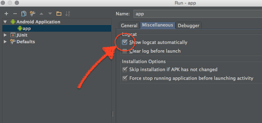
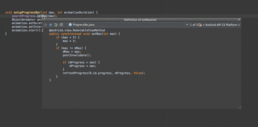

# Android-Tips

## Adb

- [Prevent ADB logcat window to open automatically every time you launch your
  app](https://plus.google.com/+LuisGonz%C3%A1lezValle/posts/3QKHE5Xaa1u):

    - Open: Run > Edit Configurations...
    - Select Miscellaneous tab
    - Untick Show logcat automatically

    


## Android Studio

- [Ctrl + Shift + I over a method to show its implementation in a modal window](https://plus.google.com/+LuisGonz%C3%A1lezValle/posts/5thU2dwYgmm)

    

## Dev

- [If you need to reference your App Package Name from your AndroidManifest.xml
  you can use:
  ${applicationId}](https://plus.google.com/+LuisGonz%C3%A1lezValle/posts/QxkDv61Buce)

    For example

``` xml
<meta-data
    android:name="com.mixpanel.android.MPConfig.ResourcePackageName"
    android:value="${applicationId}" />
```

- [One-line drawable tint using in XML using data
  binding](https://plus.google.com/+LuisGonz%C3%A1lezValle/posts/YjUcVJ14Rf5)

  Inspired by +Lisa Wray tip[1] to customise fonts using DataBinding I started exploring this lib yesterday.  
  Here there is an easy way to tint Drawables using DataBinding[2] and DrawableCompat[3] 

```java
@BindingAdapter("bind:colorTint")
public static void setColorTint(ImageView view, @ColorRes int color) {
    DrawableCompat.setTint(view.getDrawable(), color);
}
```

In XML it looks like:

```xml
<ImageView
    style="@style/circle"
    android:src="@drawable/circle"
    app:colorTint="@{item.color}"/>
```

I feel we have only started scratching the surface of DataBinding power.
Definitively check it out. It is a game changer.

> [1] [Custom Fonts tip](https://plus.google.com/+LisaWrayZeitouni/posts/LTr5tX5M9mb)  
> [2] [DataBinding](https://developer.android.com/tools/data-binding/guide.html)  
> [3] [DrawableCompat](https://plus.google.com/+LisaWrayZeitouni/posts/LTr5tX5M9mb)


## Tips

- [android-tips-tricks](https://github.com/nisrulz/android-tips-tricks)

- [Luis G. Valle (lgvalle) - Google+](https://plus.google.com/+LuisGonz%C3%A1lezValle)